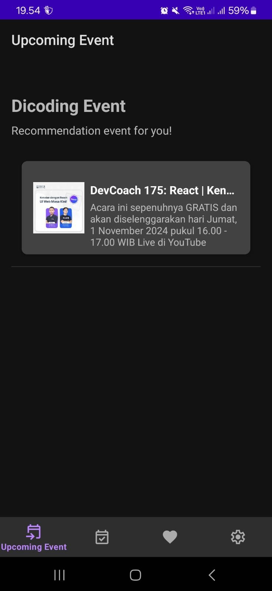
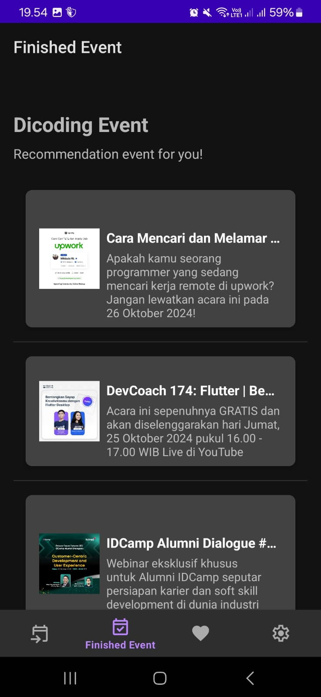
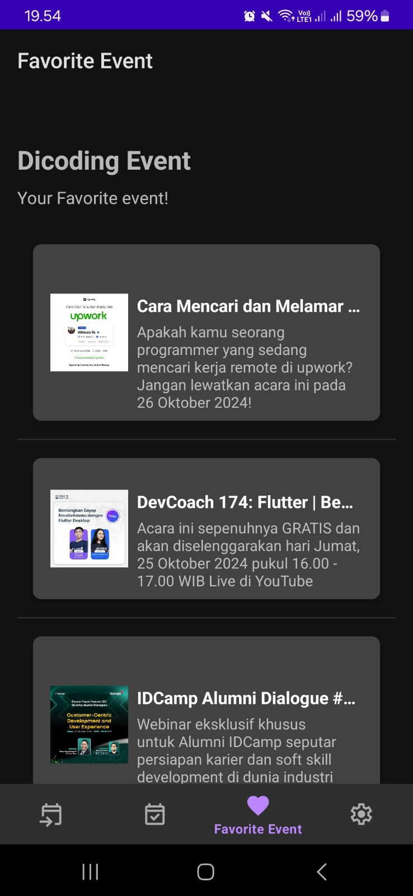
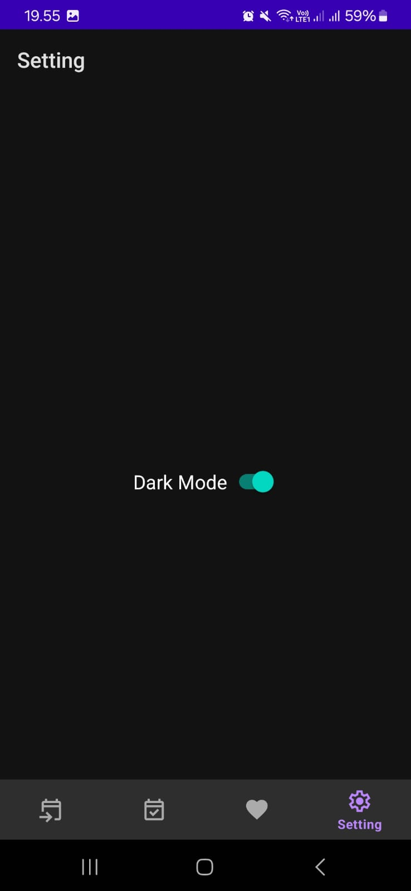

# Dicoding Event - Kotlin Android App

**Dicoding Event** adalah aplikasi Android yang dikembangkan sebagai **Submission (proyek akhir)** untuk kelas Belajar Fundamental Aplikasi Android dari Dicoding Indonesia. Aplikasi ini dibangun menggunakan **Kotlin** dan memiliki fitur utama berupa pengambilan data event dari Web API serta penyimpanan data event favorit menggunakan database lokal.

## Features

- **Integrasi Web API**: Mengambil data event secara real-time dari API untuk menampilkan daftar event terkini.
- **Manajemen Favorit**: Pengguna dapat menandai event favorit yang akan disimpan di database lokal dan diakses kapan saja.
- **Dark/Light Mode**: Mendukung tema gelap dan terang yang dapat diubah sesuai preferensi pengguna.

## Tech Stack

- **Kotlin**: Bahasa pemrograman utama dalam pengembangan aplikasi ini.
- **Retrofit**: Library untuk komunikasi HTTP dan pengambilan data dari Web API.
- **Jetpack Components**: Digunakan untuk ViewModel, Navigation, RecyclerView, dan pengelolaan lifecycle.
- **Room Database**: Menyimpan event favorit secara lokal di perangkat pengguna.
- **Glide**: Memuat dan menampilkan gambar event dari URL.
- **DataStore**: Menyimpan pengaturan tema aplikasi (light/dark mode).

## Screenshots

## Authors

- [Muhammad Ikhwan Jaizy](https://github.com/jaizyikhwan)

